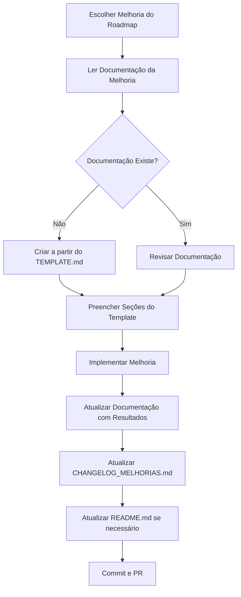

# 📚 Sistema de Documentação de Melhorias - Beatspan

## 🎯 Objetivo

Este documento descreve o sistema de documentação automática de melhorias implementado no projeto Beatspan, garantindo que todas as melhorias do roadmap sejam rastreadas e documentadas de forma consistente.

---

## 📁 Estrutura de Arquivos

```
Beatspan/
├── README.md                          # README principal atualizado
├── SETUP.md                           # Guia de configuração
├── ANALISE_ARQUITETURAL.md            # Análise técnica completa (66 páginas)
├── CHANGELOG_MELHORIAS.md             # Índice de todas as melhorias
│
└── docs/
    ├── SISTEMA_DOCUMENTACAO.md        # Este arquivo (guia do sistema)
    │
    └── melhorias/
        ├── TEMPLATE.md                # Template para novas melhorias
        │
        ├── curto-prazo/
        │   ├── 001-credenciais-env.md          # ✅ Concluído
        │   ├── 002-release-signing.md          # ⏳ Pendente
        │   ├── 003-secure-storage.md           # ⏳ Pendente
        │   ├── 004-http-timeout.md             # ⏳ Pendente
        │   ├── 005-sanitize-urls.md            # ⏳ Pendente
        │   ├── 006-testes-unitarios.md         # ⏳ Pendente
        │   ├── 007-github-actions.md           # ⏳ Pendente
        │   ├── 008-readme-completo.md          # ✅ Concluído
        │   └── 009-remover-codigo-comentado.md # ⏳ Pendente
        │
        ├── medio-prazo/
        │   ├── 010-migrar-riverpod.md          # ⏳ Pendente
        │   ├── 011-error-boundary.md           # ⏳ Pendente
        │   ├── 012-retry-logic.md              # ⏳ Pendente
        │   ├── 013-viewmodel-base.md           # ⏳ Pendente
        │   ├── 014-integrar-sentry.md          # ⏳ Pendente
        │   ├── 015-firebase-analytics.md       # ⏳ Pendente
        │   ├── 016-logger-estruturado.md       # ⏳ Pendente
        │   ├── 017-player-free.md              # ⏳ Pendente
        │   ├── 018-conteudo-rules.md           # ⏳ Pendente
        │   ├── 019-contact-form.md             # ⏳ Pendente
        │   └── 020-suporte-offline.md          # ⏳ Pendente
        │
        └── longo-prazo/
            ├── 022-cache-imagens.md            # ⏳ Pendente
            ├── 023-otimizar-blur.md            # ⏳ Pendente
            └── ...                             # (mais melhorias)
```

---

## 📋 Documentos Principais

### 1. README.md
**Descrição:** README principal do projeto
**Público:** Todos (desenvolvedores, usuários, contribuidores)
**Conteúdo:**
- Visão geral do projeto
- Setup rápido
- Features principais
- Links para documentação detalhada
- Melhorias implementadas (resumo)
- Roadmap (resumo)

### 2. SETUP.md
**Descrição:** Guia completo de configuração
**Público:** Desenvolvedores novos no projeto
**Conteúdo:**
- Pré-requisitos detalhados
- Passo a passo de instalação
- Configuração de credenciais Spotify
- Troubleshooting
- Checklist de setup

### 3. ANALISE_ARQUITETURAL.md
**Descrição:** Análise técnica completa (66 páginas)
**Público:** Arquitetos, tech leads, auditores
**Conteúdo:**
- Análise profunda de 6 categorias
- Pontuação detalhada
- Vulnerabilidades e riscos
- Roadmap completo
- Top 5 recomendações prioritárias

### 4. CHANGELOG_MELHORIAS.md
**Descrição:** Índice de todas as melhorias
**Público:** Gerentes de projeto, desenvolvedores
**Conteúdo:**
- Status geral de progresso
- Lista de todas as melhorias (curto/médio/longo prazo)
- Métricas de progresso por categoria
- Próximas melhorias recomendadas

### 5. docs/melhorias/TEMPLATE.md
**Descrição:** Template para documentar novas melhorias
**Público:** Desenvolvedores implementando melhorias
**Conteúdo:**
- Estrutura padrão de documentação
- Seções obrigatórias
- Exemplos de preenchimento
- Checklists

### 6. docs/melhorias/[fase]/[numero]-[nome].md
**Descrição:** Documentação detalhada de cada melhoria
**Público:** Desenvolvedores e revisores
**Conteúdo:**
- Problema identificado
- Solução implementada
- Código antes/depois
- Testes realizados
- Impacto da mudança
- Lições aprendidas

---

## 🔄 Workflow de Documentação

### Quando Implementar uma Melhoria



### Passo a Passo Detalhado

#### 1. Escolha da Melhoria

```bash
# Ver melhorias disponíveis
cat CHANGELOG_MELHORIAS.md

# Priorizar por:
# - P0 (CRÍTICO) > P1 (ALTO) > P2 (MÉDIO) > P3 (BAIXO)
# - Curto Prazo > Médio Prazo > Longo Prazo
# - Dependências (algumas melhorias dependem de outras)
```

#### 2. Criação da Documentação

```bash
# Copiar template
cp docs/melhorias/TEMPLATE.md docs/melhorias/curto-prazo/XXX-nome-melhoria.md

# Editar template
code docs/melhorias/curto-prazo/XXX-nome-melhoria.md
```

**Preencher seções obrigatórias:**
- [ ] Informações Gerais
- [ ] Objetivo
- [ ] Problema Identificado
- [ ] Solução Planejada
- [ ] Arquivos que serão modificados

#### 3. Implementação

```bash
# Implementar seguindo a documentação
# Atualizar documentação conforme progride
```

**Durante a implementação:**
- Documente decisões técnicas
- Capture código antes/depois
- Anote dificuldades encontradas
- Registre soluções alternativas consideradas

#### 4. Testes

```bash
# Executar testes
flutter test
flutter analyze
flutter build apk --debug
```

**Documentar:**
- [ ] Testes unitários criados
- [ ] Testes manuais realizados
- [ ] Métricas de performance
- [ ] Screenshots (se aplicável)

#### 5. Finalização da Documentação

**Preencher seções de resultado:**
- [ ] Solução Implementada (código final)
- [ ] Arquivos Modificados (lista final)
- [ ] Testes Realizados (resultados)
- [ ] Impacto da Mudança (métricas)
- [ ] Lições Aprendidas

#### 6. Atualização dos Índices

**CHANGELOG_MELHORIAS.md:**
```markdown
#### ✅ #XXX - Nome da Melhoria
- **Status:** ✅ CONCLUÍDO
- **Data:** 2025-12-31
- **Prioridade:** P0 (CRÍTICO)
- **Esforço:** 2h
- **Documentação:** [docs/melhorias/curto-prazo/XXX-nome.md](...)
- **Impacto:** Descrição do impacto
```

**README.md (se aplicável):**
```markdown
#### ✅ #XXX - Nome da Melhoria
- **Status:** CONCLUÍDO (2025-12-31)
- **Impacto:** Métrica importante
- **Documentação:** [link](...)
```

**ANALISE_ARQUITETURAL.md (marcar checkbox):**
```markdown
- [x] ~~Melhoria realizada~~ ✅
```

#### 7. Commit e Pull Request

```bash
# Commitar mudanças
git add .
git commit -m "Add: Melhoria #XXX - Nome da Melhoria

Implementação completa com:
- Código atualizado
- Testes adicionados
- Documentação completa

Refs: #XXX
"

# Push e criar PR
git push origin feature/melhoria-XXX
```

---

## 📝 Padrões de Nomenclatura

### Arquivos de Melhoria

**Formato:** `[numero]-[nome-kebab-case].md`

**Exemplos:**
- ✅ `001-credenciais-env.md`
- ✅ `002-release-signing.md`
- ✅ `015-firebase-analytics.md`
- ❌ `CredenciaisEnv.md`
- ❌ `1-credenciais.md`

### IDs de Melhoria

**Formato:** `#[numero-3-digitos]`

**Exemplos:**
- ✅ `#001`
- ✅ `#042`
- ✅ `#123`
- ❌ `#1`
- ❌ `#42`

### Status

| Emoji | Status | Uso |
|-------|--------|-----|
| ⏳ | PENDENTE | Não iniciado |
| 🚧 | EM PROGRESSO | Em desenvolvimento |
| ✅ | CONCLUÍDO | Finalizado e documentado |
| ❌ | CANCELADO | Cancelado/Descontinuado |
| ⚠️ | BLOQUEADO | Aguardando dependência |

### Prioridades

| Código | Nome | Uso |
|--------|------|-----|
| P0 | CRÍTICO | Bloqueadores de produção |
| P1 | ALTO | Importante mas não bloqueador |
| P2 | MÉDIO | Desejável |
| P3 | BAIXO | Nice to have |

---

## 📊 Métricas e Acompanhamento

### Métricas Principais

1. **Progresso Geral**
   - Total de melhorias: 39
   - Concluídas: X
   - Porcentagem: X%

2. **Por Prioridade**
   - P0: X/Y (Z%)
   - P1: X/Y (Z%)
   - P2: X/Y (Z%)
   - P3: X/Y (Z%)

3. **Por Fase**
   - Curto Prazo: X/9 (Z%)
   - Médio Prazo: X/12 (Z%)
   - Longo Prazo: X/18 (Z%)

4. **Por Categoria**
   - Segurança: X/Y (Z%)
   - Qualidade: X/Y (Z%)
   - Performance: X/Y (Z%)
   - etc.

### Atualização de Métricas

**Quando atualizar:**
- Após completar cada melhoria
- Semanalmente (review de progresso)
- Mensalmente (relatório)

**Onde atualizar:**
1. `CHANGELOG_MELHORIAS.md` - Tabelas de métricas
2. `README.md` - Estatísticas gerais
3. `ANALISE_ARQUITETURAL.md` - Checkboxes do roadmap

---

## 🎯 Boas Práticas

### ✅ SEMPRE FAÇA

1. **Documente ANTES de implementar**
   - Crie o arquivo da melhoria
   - Preencha objetivo e problema
   - Planeje a solução

2. **Atualize durante a implementação**
   - Capture código antes/depois
   - Documente decisões
   - Anote dificuldades

3. **Finalize APÓS implementar**
   - Complete todas as seções
   - Atualize índices
   - Valide links

4. **Use o Template**
   - Garante consistência
   - Não esquece seções importantes
   - Facilita revisão

5. **Seja Específico**
   - Código completo (não apenas trechos)
   - Localizações exatas (arquivo:linha)
   - Métricas reais (não estimativas)

### ❌ NUNCA FAÇA

1. **Implementar sem documentar**
   - Perde contexto histórico
   - Dificulta manutenção futura

2. **Documentação genérica**
   - "Melhorou performance" ❌
   - "Reduziu tempo de carregamento de 2s para 0.5s" ✅

3. **Esquecer de atualizar índices**
   - CHANGELOG_MELHORIAS.md
   - README.md
   - ANALISE_ARQUITETURAL.md

4. **Links quebrados**
   - Sempre validar links
   - Usar caminhos relativos

---

## 🔍 Revisão e Qualidade

### Checklist de Revisão

Antes de marcar uma melhoria como concluída:

- [ ] Documentação completa preenchida
- [ ] Código implementado e testado
- [ ] Todas as seções do template preenchidas
- [ ] Código antes/depois documentado
- [ ] Testes executados e documentados
- [ ] Métricas coletadas (se aplicável)
- [ ] Screenshots capturados (se aplicável)
- [ ] CHANGELOG_MELHORIAS.md atualizado
- [ ] README.md atualizado (se necessário)
- [ ] ANALISE_ARQUITETURAL.md atualizado
- [ ] Links validados
- [ ] Análise estática passou
- [ ] Build funcionando

### Code Review

Ao revisar um PR de melhoria:

1. **Verificar documentação:**
   - [ ] Arquivo da melhoria existe
   - [ ] Todas as seções preenchidas
   - [ ] Informações corretas e precisas

2. **Verificar código:**
   - [ ] Implementação segue a documentação
   - [ ] Testes adequados
   - [ ] Sem regressões

3. **Verificar índices:**
   - [ ] CHANGELOG atualizado
   - [ ] README atualizado (se necessário)
   - [ ] Métricas corretas

---

## 📚 Exemplos

### Melhoria Bem Documentada

✅ **Exemplo:** [001-credenciais-env.md](melhorias/curto-prazo/001-credenciais-env.md)

**Por que é boa:**
- Todas as seções preenchidas
- Código completo antes/depois
- Testes documentados
- Métricas de impacto
- Lições aprendidas
- Links funcionais

### Elementos Essenciais

1. **Contexto claro:**
   ```markdown
   ## 🔴 Problema Identificado

   **Localização:** `lib/app/di.dart:54`

   ```dart
   final clientId = '8e1f4c38cf5543f5929e19c1d503205c'; // ❌
   ```
   ```

2. **Solução específica:**
   ```markdown
   ## ✅ Solução Implementada

   **Antes:**
   ```dart
   // código anterior
   ```

   **Depois:**
   ```dart
   // código novo
   ```
   ```

3. **Impacto mensurável:**
   ```markdown
   ## 📊 Impacto

   | Métrica | Antes | Depois | Melhoria |
   |---------|-------|--------|----------|
   | CVSS | 9.1 | 2.0 | -7.1 |
   ```

---

## 🔄 Manutenção

### Atualização Regular

**Semanal:**
- [ ] Revisar progresso das melhorias
- [ ] Atualizar métricas no CHANGELOG
- [ ] Verificar links quebrados

**Mensal:**
- [ ] Atualizar README com progresso
- [ ] Revisar roadmap
- [ ] Ajustar prioridades se necessário

**Por Melhoria:**
- [ ] Documentar lições aprendidas
- [ ] Atualizar template se necessário
- [ ] Compartilhar conhecimento com time

---

## 🎓 Treinamento

### Para Novos Desenvolvedores

1. **Leia este documento completo**
2. **Estude uma melhoria concluída:** [001-credenciais-env.md](melhorias/curto-prazo/001-credenciais-env.md)
3. **Pratique com melhoria simples:** Comece com P3
4. **Peça revisão:** Primeiro PR com atenção especial à documentação

### Recursos

- [Markdown Guide](https://www.markdownguide.org/)
- [Template de Melhoria](melhorias/TEMPLATE.md)
- [Análise Arquitetural](../ANALISE_ARQUITETURAL.md)

---

## 📞 Suporte

**Dúvidas sobre o sistema de documentação:**
- Leia este documento primeiro
- Veja exemplos de melhorias concluídas
- Consulte o TEMPLATE.md
- Abra uma issue se necessário

---

## 📝 Histórico de Mudanças

| Data | Versão | Mudança |
|------|--------|---------|
| 2025-12-31 | 1.0.0 | Sistema de documentação criado |

---

**Mantido por:** [@davicezarborgesdeveloper](https://github.com/davicezarborgesdeveloper)
**Última Atualização:** 2025-12-31
